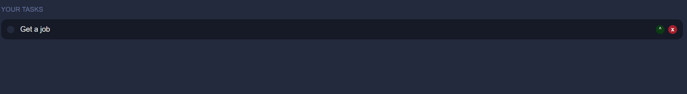

# MERN Todo App

A full-stack Todo application built with the MERN stack (MongoDB, Express.js, React, Node.js). This app allows users to add, update, complete, and delete tasks with a simple and clean user interface.

## 🚀 Features

- ✅ Create, edit, delete todos
- 📌 Mark tasks as complete/incomplete
- 🔍 Filter by completion status
- 🌐 RESTful API with Express and MongoDB
- ⚛️ React frontend with real-time updates
- 📦 Backend and frontend connected via Axios

## 🛠️ Tech Stack

- **Frontend:** React, Axios, Bootstrap/Tailwind (choose one)
- **Backend:** Node.js, Express.js
- **Database:** MongoDB (Mongoose)
- **Others:** Nodemon, Concurrently

## 📸 Screenshots

| Dashboard | Add Todo | Edit Todo |
|----------|----------|-----------|
|  |  |  |

